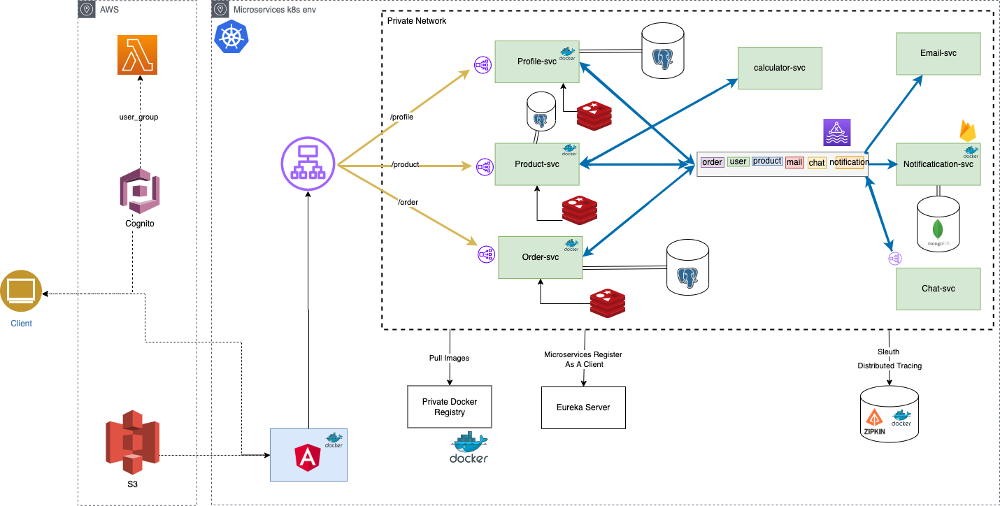

# Camel Technology
Is an e-commerce system for selling technology products based on the clients requirements,
we decomposed the application to 7 microservices each one has high cohesion , loose coupling , information hiding and for sure SOLID principles.

# Techonologies
* Spring Boot 
* Angular
* Cognito
* S3
* Kafka 
* Postgres
* Eureka Server
* Kubernetes
* Redis
* Zipkin
* Docker

# Requirements
* This application is build to be run in a docker container so you should have DOCKER installed
* Inside docker-compose file you will find all the services
* You can also run the application in k8s environment

**Note**
* You should run docker-compose file -> docker-compose up be sure to be in the same directory as the docker-compose file
* You should set docker resource memory : 8 GB

# Instruction
* Install docker in your local machine, go to dir where you store docker-compose file
* Open terminal and be sure you are in the same directory as the docker-compose file 
* Run Docker Containers:
* First build the image : 
* docker-compose build 

* When ready, run it :
* docker-compose up 

* If you make any changes you will need to re-build :
* docker-compose build --no-cache 

# Microservices
* Profile-svc -> contains different functions about users of the platform like wishlist,
tracking , autorecommendation , shopping cart and historical order.

* Order-svc -> contains functions like order handling , coupon for discount price for order , order processing that is a functions
that handles the inventory management to not make double orders on the last item.

* Product-svc -> has functions about products to our shop , inventory management , comparison , warehouse , search .

* Notification-svc -> sends push notifications to our application for any reminder or order made.

* Mail-svc -> sends mail for any reminder and for orders but have more detailed informations.

* Calculator-svc -> handles the part to not allow every coupon to be used , calculates the % discount to every price and calculates the new prices of products
when the auto-currency switch is in play.

* Chat-svc -> is used for communaction between the client and the supporter.

**Note**
* This application is run based on profiles in the resource folder you have the profile for each environment so careful
* Documentation not finish yet, if you want test apis, please check gateway config. and apis defined inside each controllers in microservices

# Microservice - Architecture
